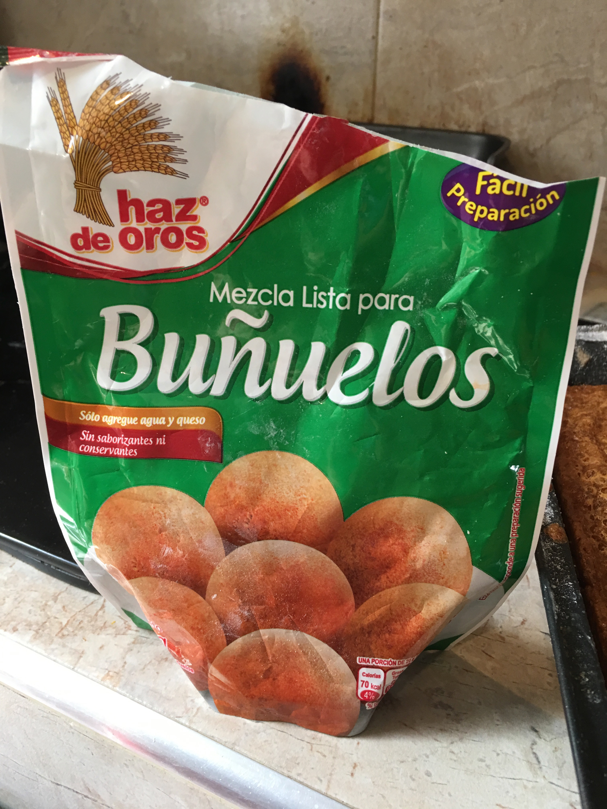
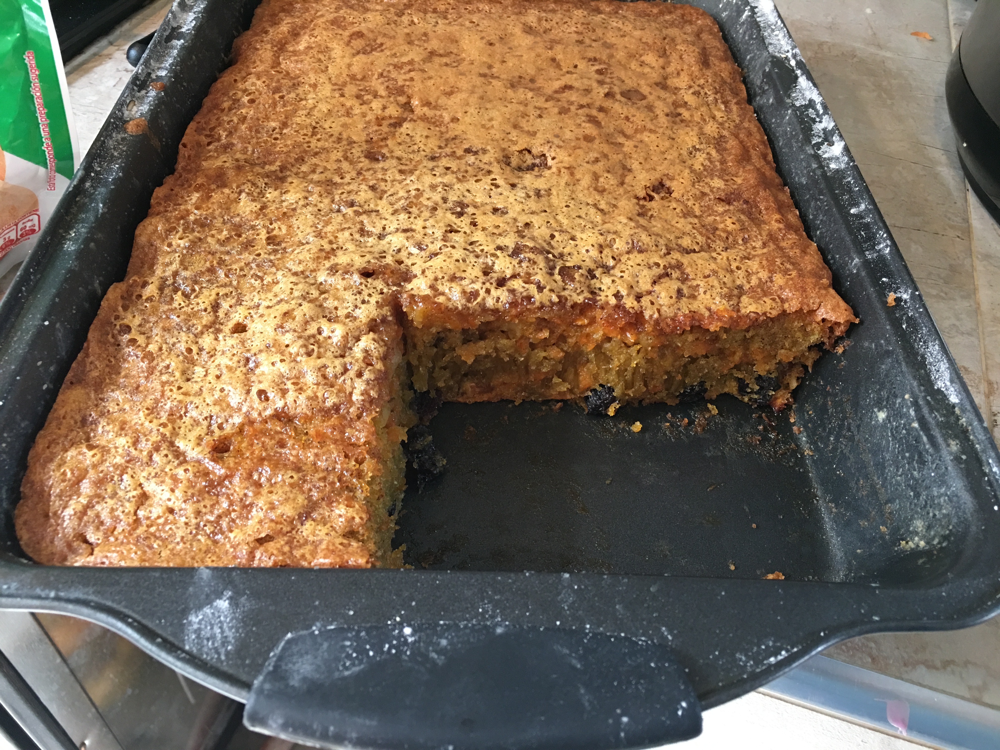

```{r setup, include=FALSE}
knitr::opts_chunk$set(echo = TRUE)
```

As if baking at 8,600 feet wasn't a tough enough challenge, this cake also
needed to be gluten-free. This gluten-free carrot cake is based on this recipe:

<https://delishably.com/desserts/High-Altitude-Cooking-Carrot-Cake>

I made the following changes to make it gluten-free. I replaced wheat flour with buñuelo flour, which is made of corn starch and yuca (tapioca) flour. I increased the eggs from 4 to 5, and reduced the sugar from 1.5 cups to 1 cup. Since I'm a real nerd I wrote the recipe in RMarkdown and stored it on GitHub.

### Ingredients

- 5 eggs

- 1 cup granulated sugar

- 1 tsp. vanilla

- 1 ½ cups cooking oil

- 2 cups Buñuelo flour

- 2 tsp. baking powder

- 1 tsp salt

- 2 tsp. ground cinnamon

- ½ tsp pumpkin pie spice

- 3 ½ cups grated carrots

- 1 cup chopped nuts

- 1 cup raisins

### Directions

- Preheat oven to 350 degrees F or 160 degrees C.

- Grease and flour baking pan.
- In large bowl, beat sugar and eggs until thick and creamy yellow.
- Add vanilla and oil, beating well.
- Mix all dry ingredients: flour, baking powder, salt, cinnamon and allspice.
- Add dry ingredients slowly to egg mixture, mixing thoroughly.
- Fold in carrots, nutmeats and raisons.
- Pour into prepared pan.
- Bake about 45 minutes or until cake center springs back when pressed with fingertip.
Cool.
- Optional: Frost with Cream Cheese Frosting




